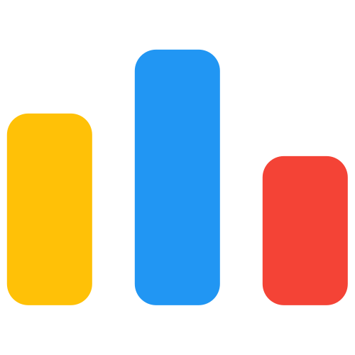

# I'm [Abhishek Hegde](https://github.com/abhishekHegde2000)👋

## 

<!-- <h2 align="center">

</h2> -->

## About me
### ✨ Creating bugs since  2022
### 📚 I'm a Techie nerd
### 🎯 Goals: Hustle to get into 0.1%
### 🎲 Fun fact: If its working, don’t touch it

 

## 🚀 Connect with me

<!-- ## 👨‍💻Coding Profile

 -->

<!-- ## 👨‍💻Coding Profile

 -->

## 👨‍💻Coding Profile

## 🛠️Skills
### I Code in

<!-- ### Web Development
 -->

### Frontend

### Backend

### Tools

## 📊Github Stats

<!-- 

 -->

&nbsp;

 

<!-- ## 📊 GitHub Stats:

 -->

<!-- ### 🐍 Watch Snake eating my contribution -->

<!--  -->

<!-- ## 🏆 GitHub Trophies
 -->

<!--  -->

<h2 align="center">

</h2>

